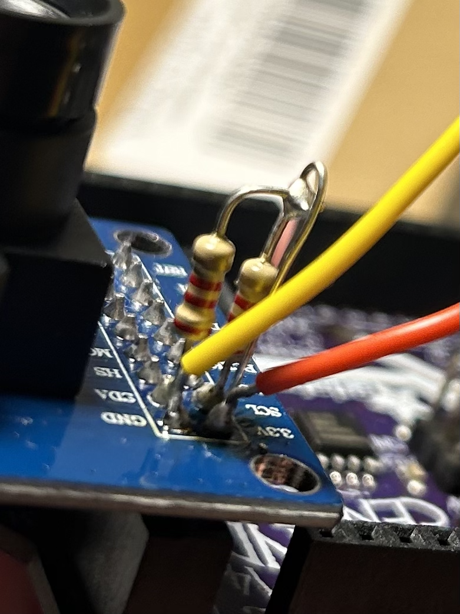
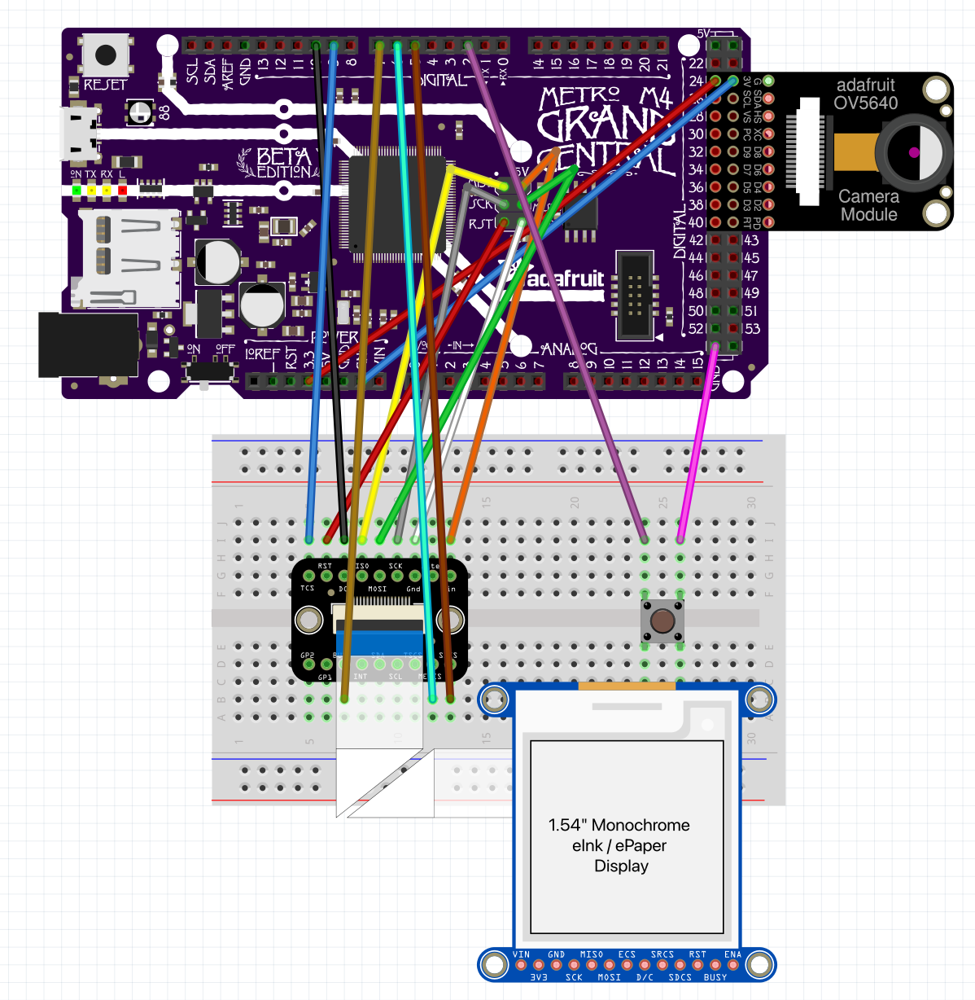
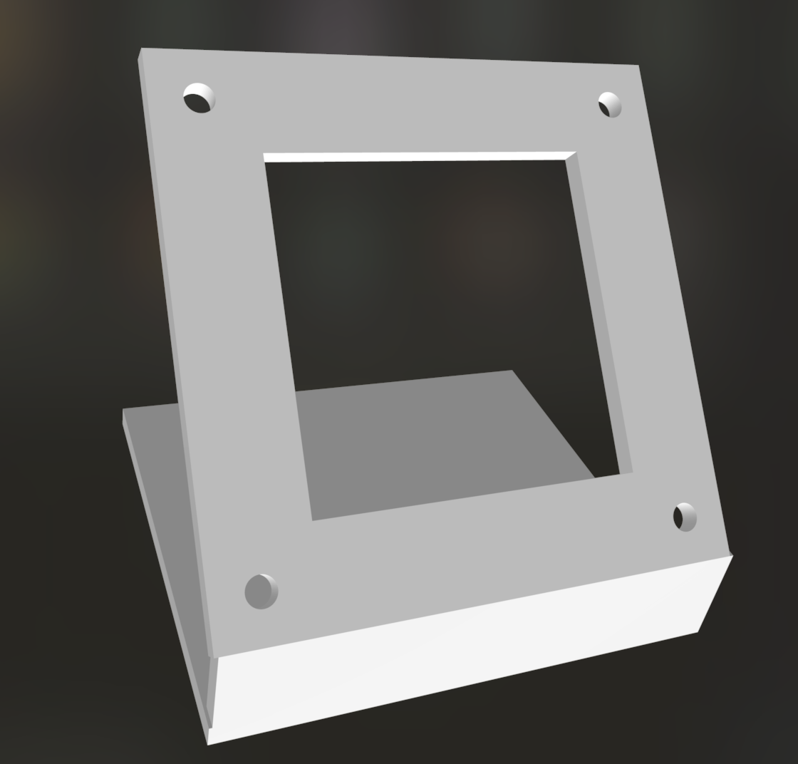

# EInk Camera
A camera that uses an eInk display, using the Adafruit Grand Central M4.

## Summary
This project is an eInk camera. The camera takes a picture of the user when they click a button, saves it to an SD card, then flashes it onto an eInk display. 
More of the design details and process can be found in the writeup I did on [my website](https://davidjihwan.com/TODO)

## Media
Thresholding:  

Dithering (default):  

The full interaction (dithering):  

Closeup:  

## Materials
- [Arduino IDE](https://www.arduino.cc/en/software)
- [Adafruit Grand Central M4 Express](http://www.adafruit.com/product/4064#tutorials)
- [Adafruit 1.54" Monochrome eInk / ePaper Display with SRAM](http://www.adafruit.com/product/4196#tutorials)
- [Adafruit EYESPI Breakout Board](http://www.adafruit.com/product/5613#tutorials)
- [EYESPI Cable - 18 Pin 100mm long Flex PCB (FPC) A-B type](https://www.adafruit.com/product/5239#tutorials)
- Micro USB cable (data)
- SD Card
- OV7670 Camera Module
- 2x: 2.2k resistors
- Breadboard
- M-F jumper wires
- M-M jumper wires
- Wires
- Pushbutton
  
Optional (for display enclosure):
- 2x: M2 screws & nuts

This project also requires soldering.

## Quick Start Guide
Camera setup:
1. Install the Adafruit OV7670 library using the Arduino Library Manager. 
2. Follow Phillip Burgess' guide "Adafruit OV7670 Camera Library For SAMD51 Processors" to modify the OV7670 camera to interface with the Grand Central: 
[https://learn.adafruit.com/adafruit-ov7670-camera-library-samd51/hardware](https://learn.adafruit.com/adafruit-ov7670-camera-library-samd51/hardware)  
Your camera should look like this after modification:  
<a href="url">  
<a href="url">
Insert the camera into the Grand Central as detailed in the guide:  
<a href="url">
4. Ensure that the camera is working using the "selfie" example in the "Adafruit OV7670" library. You don't need the TFT screen; just remove the SD card and check the images manually. 

Eink setup:
1. Install the Adafruit EPD library using the Arduino Library Manager. 
2. Wire connections following the wiring diagram below.
3. Ensure that the eink display is working using the "ThinkInk_Mono" example in the "Adafruit EPD" library. If this isn't working, make sure to check that you are using a good data transfer micro USB cable. I ran into an issue where the subpar cable I used couldn't handle both the camera and eink display being plugged in at the same time.

Here's the wiring diagram for this project.  
<a href="url"> 

Here's what your wiring should look like: 
<a href="url">  
<a href="url">  

Project Installation and Setup:
1. Download the Arduino project file to write to serial output [here](Arduino/Eink_Camera/Eink_Camera.ino).
3. Open the project file.
4. Change your board: Tools > Boards > Adafruit SAMD Boards > Adafruit Grand Central M4
5. Change the port: Tools > Port > your-port (mac users should select “wchusb")
6. Plug the Grand Central into your computer.
7. Press the upload button (at the top left of the window) to upload your code to the board. Arduino should automatically download any missing dependencies. 
8. That's it! After you click the button, the image should be flashed onto the eink display. 

Optional Enclosure:  
<a href="url">
1. Download the file for the joystick enclosure [here](3D_Models/EInkStandScaled.stl) and print it.
2. Screw the eink display onto the back of the enclosure using M2 screws and hold it in place using the corresponding nuts.
The final enclosure looks like this:  
<a href="url">

I also tried making a cardboard enclosure for the camera:
<a href="url">

